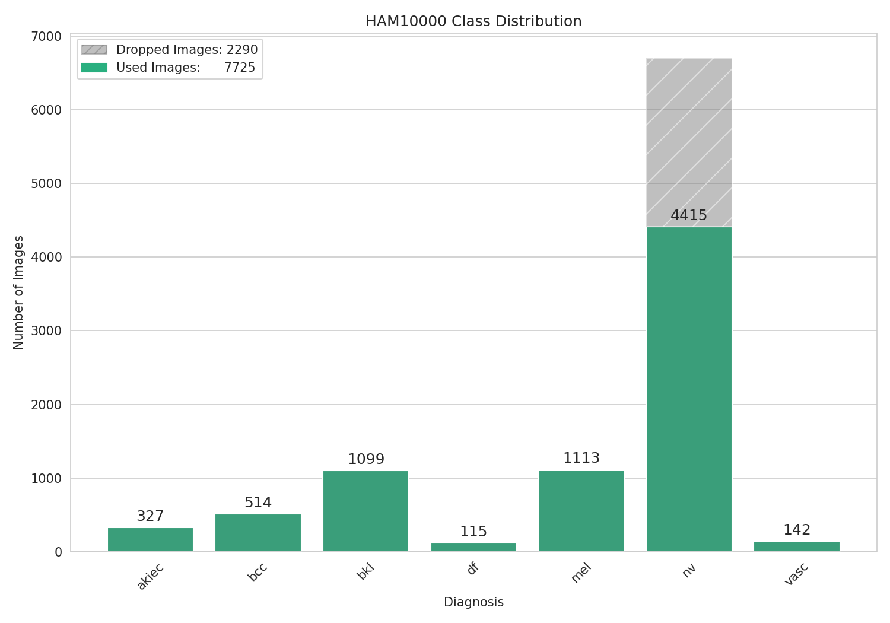
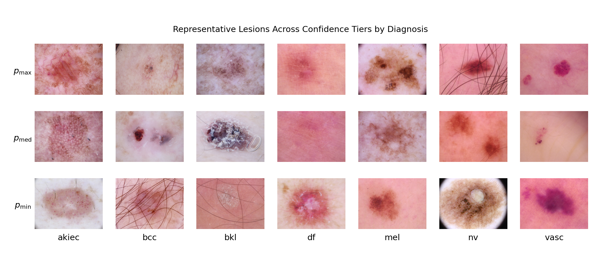
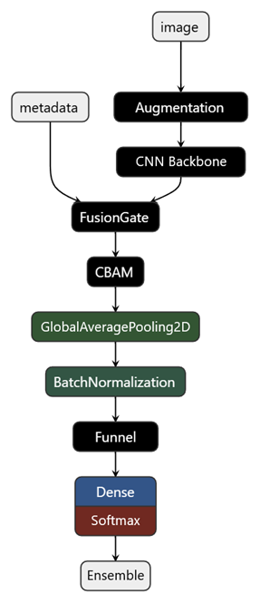
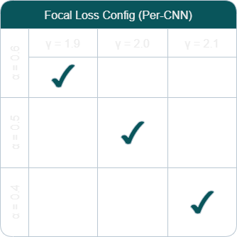
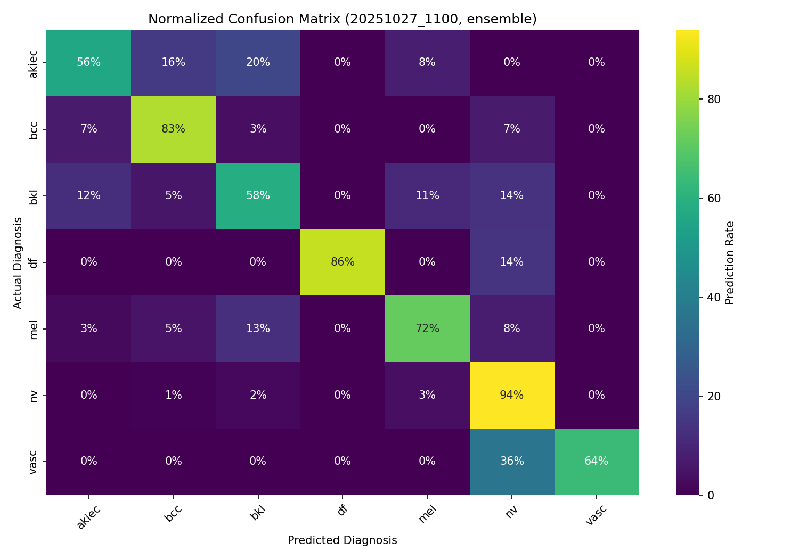
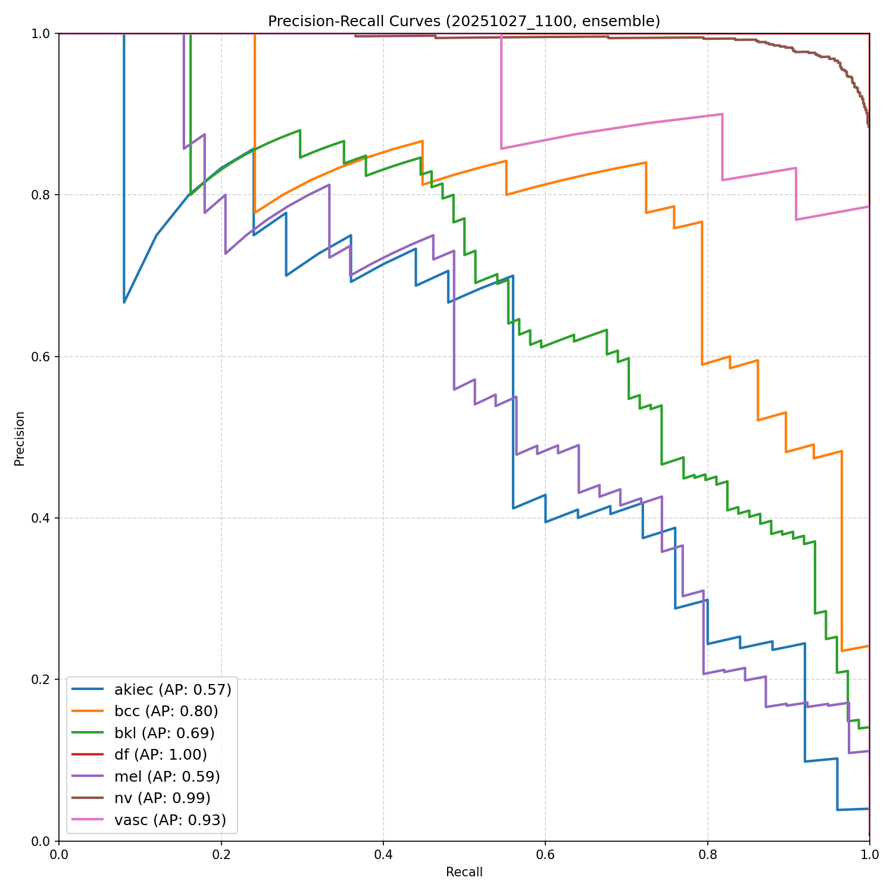

# Teaching AI to Spot Skin Cancer


> A transfer learning ensemble that integrates dermoscopic image features and patient metadata via multimodal fusion for 
> multiclass classification of skin lesions.

## Introduction

In about four minutes, someone will die from skin cancer. It's a disease that hides in plain sight—visible to the naked
eye, yet often overlooked until it's too late. The absurd irony is that most of these cases are preventable; the clues 
are literally right on the surface.

This project builds a deep learning tool for screening skin lesions. Variants of two lightweight models 
(EfficientNetB1 and ResNet50) learn from dermoscopy images paired with patient metadata, each generating independent 
predictions. An ensemble merges these into a consensus diagnosis, providing immediate and reliable assessments.

## Dataset

The HAM10000 dataset consists of dermoscopic images of biologically diverse skin lesions:

| Lesion Type                                   | Label | Category          |
|-----------------------------------------------|-------|-------------------|
| Actinic Keratosis / Intraepithelial Carcinoma | akiec | ⚠️ Premalignant   |
| Basal Cell Carcinoma                          | bcc   | ❌ Malignant       |
| Benign Keratoses                              | bkl   | ✅ Benign          |
| Dermatofibroma                                | df    | ✅ Benign          |
| Melanocytic Nevi                              | nv    | ✅ Benign          |
| Melanoma                                      | mel   | ❌ Malignant       |
| Vascular Lesions                              | vasc  | ⚠️ Usually Benign |

### Lesion Distribution


> Due to extreme class imbalance, melanocytic nevi were undersampled by removing their duplicate images, whereas 
> duplicate images from minority classes were retained in the training set. This preserves lesion-level integrity across 
> splits while leveraging minority duplicates as natural augmentation.

### Lesion Visualization


> Sample images arranged by the ensemble model's predicted probability for the ground-truth 
> diagnosis. Rows correspond to maximum, median, and minimum confidence cases, revealing morphological 
> heterogeneity and task difficulty (even for dermatologists!).

### Metadata

Three clinically relevant metadata categories were used during model training: age, lesion localization 
(e.g., neck, back, etc.), and sex. These features capture demographic and anatomical patterns that a custom fusion 
mechanism exploits to improve lesion classification.

Exploratory visualizations of these distributions are available [here](assets/meta_dist.pdf).

### Acquisition

Tschandl, P. (2018). The HAM10000 dataset, a large collection of multi-source dermatoscopic images of common pigmented 
skin lesions (Version V4) [dataset]. Harvard Dataverse. https://doi.org/10.7910/DVN/DBW86T

## Architecture
<table>
<tr>
<td width="300">

</td>
<td width="300" valign="top">

<ul>
<li>Metadata is mapped into channel-wise gates via a single-layer perceptron with Gaussian noise regularization.</li>
<br>
<li>A learnable scalar adjusts gate potency before multiplicative fusion with convolutional features, allowing the model to 
globally modulate metadata influence.</li>
<br>
<li>The fused tensor traverses a convolutional block attention module (CBAM) that 
applies channel and spatial attention for adaptive feature enhancement.</li>
<br>
<li>A dense funnel distills discriminative cues 
used to compute class logits.</li>
<br>
<li>Softmax probabilities from swappable CNN backbones are ensembled for performance gains.</li>
</ul>

</td>
</tr>
</table>

*Tip for mobile users: rotate device horizontally for larger schematic.*

## Methodology
A CNN backbone pretrained on ImageNet was used for initial feature extraction. A unique classification head was first 
calibrated to prevent catastrophic forgetting during fine-tuning. Unfreezing proceeded in two phases: high-level feature 
adaptation followed by mid-level feature adaptation. Due to considerable domain shift between HAM10000 and ImageNet, a 
more aggressive learning rate schedule was used during the first unfreeze to encourage remapping of nontransferable 
high-level features. Lastly, predictions from distinct models were ensembled by averaging per-diagnosis probabilities, 
promoting complementary decision boundaries.

### Loss Function
Focal loss was used instead of standard cross-entropy loss in order to accommodate class imbalance and sample-wise 
classification difficulty. A variant of this algorithm was implemented as a specialized `Loss` object to handle sparse 
labels and use inverse-frequency class-weighted $\alpha$ values. The general form is:

$$\text{FL}(p_t) = -\alpha_t (1 - p_t)^\gamma \log(p_t)$$

Where: 
- $p_t$ is the true class probability
- $\alpha_t$ is the balancing parameter
- $\gamma$ is the focusing parameter

### Multimodal Fusion
A gated metadata tensor, derived via nonlinear activation, was multiplicatively fused with its corresponding image 
tensor—rather than concatenated—to account for incompatible semantic structures between modalities:

$$x(1 + \alpha m)$$

Here, $x$ is the image tensor, $m$ is the metadata tensor, and $\alpha$ is a learnable scaling factor. This fusion 
process biases the subsequent CBAM toward metadata-relevant attributes and image regions.

### Dense Funnel
Simple classifiers are typical for this type of transfer learning, particularly with moderately sized datasets. However, 
experiments showed better performance when increasing the expressive capacity of the network head: a slightly larger, 
funnel-like architecture of three dense layers, with node counts and dropout rates halved sequentially. `swish` 
activations were used instead of `relu` to mitigate 'dead neuron' issues and maintain smoother gradients.

### Ensemble
Models with different backbones and/or trained with distinct focal loss parameters exhibited diverse classification 
behaviors. Accordingly, six models were selected for ensembling based on CNN architecture and subtle focal loss 
variations to stabilize predictions and reduce variance:



### Training Loop
This iterative workflow was employed to balance computational efficiency with manual oversight during model development:  

1. Head calibration
2. Low-depth unfreeze
3. Mid-depth unfreeze
4. Hyperparameter tuning or architectural modification
5. Repeat 1-4 (as needed)

## Results

### Classification Summary

| Model          | Accuracy | Macro-F1 |
|----------------|----------|----------|
| EfficientNetB1 | 86.6%    | 0.713    |
| ResNet50       | 86.1%    | 0.649    |
| Ensemble       | 88.4%    | 0.730    |

*Non-ensemble metrics represent averages across models sharing the same CNN architecture but trained with focal loss 
parameter offsets of ± 0.1.*

### Confusion Matrix


### Precision-Recall Curves


## Discussion
Even after undersampling duplicate nevi samples, class imbalance (57.2% majority) remained substantial. 
`SparseCategoricalFocalCrossentropy` improved minority-class signal recovery, while maintaining strong performance 
(95.3% accuracy) on the majority class. Despite this, clinically-critical confusion persisted between benign keratoses 
and melanomas, with a misclassification rate of ~15%. This overlap is well documented in dermoscopy, where similar 
confusion rates are observed among clinicians. Additional methods (e.g., ensembling with a binary melanoma classifier, 
incorporating morphological priors, etc.) would be needed to better resolve these decision boundaries.

`EarlyStopping` with validation-loss monitoring, dropout regularization, and weight decay reduced overfitting to the 
training set. However, extensive hyperparameter tuning and macro-F1 checkpointing introduced mild overfitting to the 
validation set. Rather than suppress this behavior (e.g., by modifying callbacks), it was integrated into the design: 
ensembling leveraged the resulting diversity to average out model-specific noise while preserving complementary decision 
boundaries. This yielded improved performance and robustness with negligible inference-time cost, owing to the 
efficiency of the underlying CNNs.

## Usage
Extract HAM10000 images archive into `/data`, keeping the original folder names:
```
/data/
├── HAM10000_images_part_1/
└── HAM10000_images_part_2/
```

The top-level configuration object is:
```python
cfg = Config(
    exp=ExpConfig(
        mode='train',
        backbone='resnet50',
        checkpoint=None,
        unfreeze=None,
        model_pool=None
    ),
    train=TrainConfig(
        batch_size=64,
        dropout_rates=(0.5, 0.25, 0.125),
        epochs=100,
        focal_loss=(0.5, 2.0, 0.1),
        initial_lr=1e-3,
        lr_decay=True,
        patience=10,
        warmup_target=None,
        weight_decay=1e-4
    )
)
```
### Instructions:
- Fresh Run: `mode='train'`, `checkpoint=None`, `unfreeze=None`
- Resume Train: set `checkpoint='path/to/model.keras'` and `unfreeze='layer_name'`
- Validate/Test: `mode='validate'` or `mode='test'`, and set `checkpoint`
- Ensemble: `mode='ensemble'` and populate `model_pool`

#### Notes:
- `cfg` is type-enforced and documented—editing it directly is safe.
- Set nonapplicable fields to `None`

## References
Carrera et al. (2017). *Dermoscopic Clues for Diagnosing Melanomas That Resemble Seborrheic Keratosis* 
[PMID: 28355453](https://pubmed.ncbi.nlm.nih.gov/28355453)

He, K., Zhang, X., Ren, S., & Sun, J. (2015). *Deep Residual Learning for Image Recognition* 
[arXiv:1512.03385](https://arxiv.org/abs/1512.03385)

Tan, M., & Le, Q. V. (2019). *EfficientNet: Rethinking Model Scaling for Convolutional Neural Networks* 
[arXiv:1905.11946](https://arxiv.org/abs/1905.11946)

Woo, S., Park, J., Lee, J.-Y., & Kweon, I. S. (2018). *CBAM: Convolutional Block Attention Module* 
[arXiv:1807.06521](https://arxiv.org/abs/1807.06521)

## Ideas
Potential improvements that may be explored in the future:

- Additional dataset support (e.g., ISIC 2019)
- Bayesian optimization (low priority; may exacerbate validation noise)
- Cloud GPU training with a ConvNeXt backbone
- Deployment (high priority)
- Melanoma specialist model